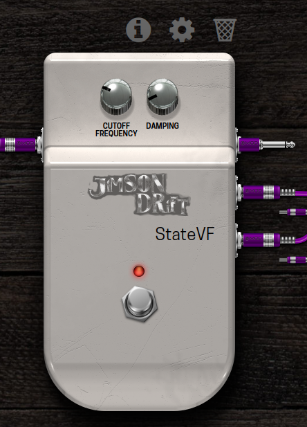

# StateVF
A state variable filter. This is a filter which output a highpass, bandpass and lowpass signal.
The damping factor allows for resonant sounds when set near zero. TREAT WITH CAUTION, YOU CAN DAMAGE YOU EARS!
The UI was implemented for the MOD Duo from moddevices.com, however the plugin loads well in other lv2 hosts.
Controlled by an expression pedal and with a damping factor ~ 0.1 the lowpass output sounds like a traditional Wha-Wha effect.
An interesting addition to this is to pipe the highpass through a reverb (set the wet parameter of the reverb to 100%) and the bandpass
through a delay




## Build
You need the lv2 development headers and libraries. On ubuntu (or any debian derivativ) run
```bash
sudo apt-get install lv2-dev
```
then build
```bash
make
```

## Install
You must tell the installer where the lv2 bundle is to be installed
```bash
LV2DIR=/path/to/lv2plugins make install
```

For uninstalling run
```bash
LV2DIR=/path/to/lv2plugins make unstall
```

## Test
You must have jalv.qt5 installed to run the test.
First start jackd (I use qjackctl as the frontend)
Run
```bash
LV2DIR=/path/to/lv2plugins make test
```

## Build for MOD Duo

Install mod-plugin-builder. Then in the directory mod-plugin-builder/plugins/package create a link to the directory 
where this repo is cloned
```
cd ~/mod-plugin-builder/plugins/package
ln -s /path/to/StateVariableFilter-LV2 .
```

Build the plugin for modduo
```
cd ~/mod-plugin-builder
./build modduo StateVariableFilter-LV2-dirclean
./build modduo StateVariableFilter-LV2
```

Connect your MOD Duo and push the plugin to the device:
```bash
./build modduo StateVariableFilter-LV2-publish
```